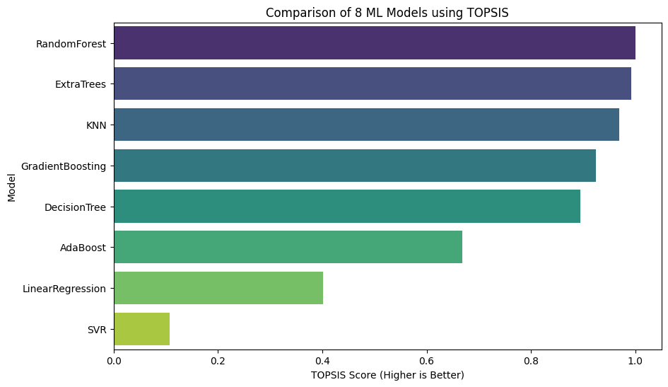

# Optimizing Bank Queue Operations: A Simulation & ML Approach

## Project Overview
This project applies **Modelling & Simulation** techniques to generate a synthetic dataset for a bank queuing system, followed by a **Machine Learning** analysis to predict customer wait times. The goal is to determine which regression model best captures the relationship between bank resources (tellers) and service efficiency.

Finally, the **TOPSIS (Technique for Order of Preference by Similarity to Ideal Solution)** method is applied to rank 8 different ML models to find the most accurate and robust predictor.

## User Details
- **Name:** Gurdarshan Singh
- **Roll Number:** 102303217
- **Submission:** Data Generation & Model Evaluation Assignment

---

## 1. Methodology

The project was executed in three distinct phases: Simulation, Training, and Evaluation.

### Step 1: Data Generation (The Simulation)
Using the **SimPy** discrete-event simulation library, a "Bank" environment was modeled.
- **Concept:** Customers arrive at the bank at random intervals and request service from a limited number of "Tellers" (Resources). If all tellers are busy, customers queue up.
- **Parameters:**
    - **Tellers (Independent Variable):** Randomized between 1 and 5.
    - **Arrival Interval (Independent Variable):** Randomized between 2 to 10 minutes (λ).
    - **Service Time (Independent Variable):** Randomized between 5 to 15 minutes (µ).
- **Target Variable:** `Average_Wait_Time` (The average time a customer spent waiting in line).
- **Volume:** The simulation was run **1000 times** with varying random parameters to create a robust dataset (`bank_simulation_data.csv`).

### Step 2: Machine Learning
The generated dataset was split into training (80%) and testing (20%) sets. Eight different regression models were trained to predict the `Average_Wait_Time`:
1.  **Linear Regression:** Baseline linear model.
2.  **Random Forest:** Ensemble method using bagging.
3.  **Gradient Boosting:** Ensemble method using boosting.
4.  **Support Vector Regressor (SVR):** Uses hyperplanes for regression.
5.  **Decision Tree:** Simple tree-based model.
6.  **K-Nearest Neighbors (KNN):** Distance-based regression.
7.  **AdaBoost:** Adaptive boosting algorithm.
8.  **ExtraTrees:** Extremely randomized trees.

### Step 3: Evaluation with TOPSIS
To accurately rank the models, we used the **TOPSIS** method. A single metric (like Accuracy) is often insufficient. TOPSIS allows us to consider multiple performance metrics simultaneously:
- **Mean Squared Error (MSE):** Weight = 1, Impact = (-) Minimize
- **Root Mean Squared Error (RMSE):** Weight = 1, Impact = (-) Minimize
- **Mean Absolute Error (MAE):** Weight = 1, Impact = (-) Minimize
- **R2 Score:** Weight = 1, Impact = (+) Maximize

---

## 2. Quantitative Results

The following table displays the performance metrics for all 8 models. **Random Forest** achieved the highest R2 score (0.898) and the lowest error rates, earning it the #1 Rank via TOPSIS.

| Model | MSE | RMSE | MAE | R2 Score | TOPSIS Score | Rank |
| :--- | :--- | :--- | :--- | :--- | :--- | :--- |
| **RandomForest** | **246.97** | **15.71** | **8.08** | **0.898** | **1.0000** | **1** |
| ExtraTrees | 251.70 | 15.86 | 8.40 | 0.896 | 0.9917 | 2 |
| KNN | 281.28 | 16.77 | 8.93 | 0.884 | 0.9695 | 3 |
| GradientBoosting | 324.89 | 18.02 | 10.50 | 0.866 | 0.9239 | 4 |
| DecisionTree | 389.76 | 19.74 | 10.31 | 0.839 | 0.8941 | 5 |
| AdaBoost | 590.63 | 24.30 | 20.08 | 0.756 | 0.6679 | 6 |
| LinearRegression | 1063.75 | 32.61 | 26.55 | 0.561 | 0.4010 | 7 |
| SVR | 1876.12 | 43.31 | 21.64 | 0.226 | 0.1078 | 8 |

---

## 3. Graphical Analysis

The bar chart below visualizes the **TOPSIS Score** of each model.
- **Tree-based models** (Random Forest, ExtraTrees, Gradient Boosting) dominate the leaderboard, indicating that the relationship between queue resources and wait time is **non-linear**.
- **Linear Regression** and **SVR** performed poorly, suggesting they failed to capture the complexity of the queuing simulation.



---

## 4. How to Reproduce

### Dependencies
Ensure you have the following libraries installed:
```bash
pip install simpy scikit-learn pandas numpy matplotlib seaborn Topsis-Gurdarshan-102303217


### Execution

1. **Generate Data:** Run the simulation block in the notebook to create `bank_simulation_data.csv`.
2. **Train Models:** Run the training block to generate `model_performance.csv`.
3. **Rank Models:** The notebook automatically applies the `topsis` command:
```bash
topsis model_performance.csv "1,1,1,1" "-,-,-,+" result.csv

```


```

```